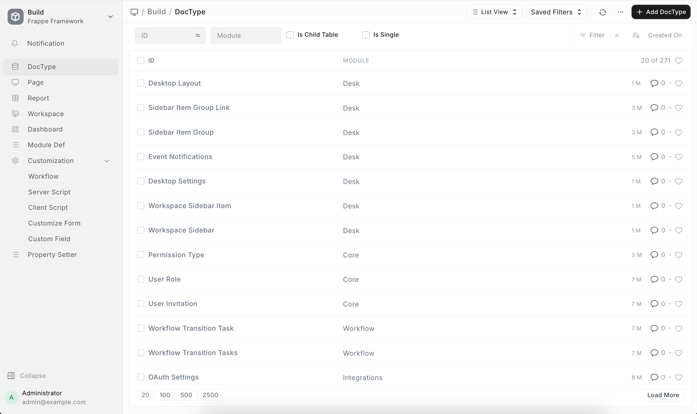
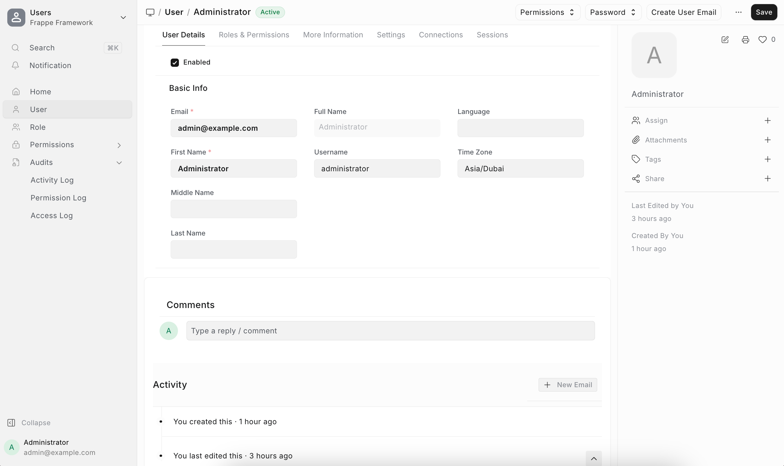
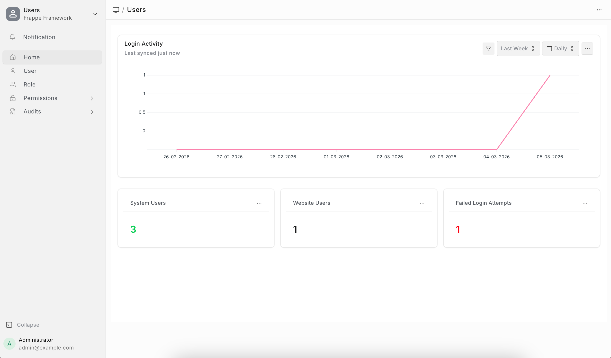
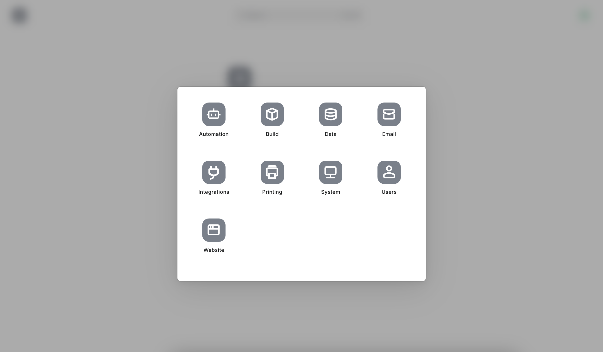

# Leany

A cleaner, more easy on the eyes UI override for Frappe Desk.

Leany provides a minimal, flat, and modern design system for Frappe apps that simplifies interfaces without sacrificing functionality. By utilizing subtle borders, muted text colors, and ghost styling, it creates a cleaner and more focused user experience.

## Screenshots

| List View | Form View |
|:-:|:-:|
|  |  |

| Workspace | Desk |
|:-:|:-:|
|  |  |

### Features
- Streamlined form layouts with reduced noise.
- Clean ghost styling for action buttons and filters.
- Better list views with flat headers, refined hover states, and seamless card pagination.
- Harmonized inputs, modals, timelines, and more.
- Full dark mode support.

### Installation

You can install this app using the [bench](https://github.com/frappe/bench) CLI:

```bash
cd $PATH_TO_YOUR_BENCH
bench get-app https://github.com/esafwan/leany-frappe.git --branch develop
bench install-app leany
```

### Usage (Going Live)

After installing the app on your site, make sure you rebuild the assets and clear the cache so the CSS overrides apply correctly:

```bash
bench build --apps leany
bench clear-cache
bench restart
```

### Contributing

This app uses `pre-commit` for code formatting and linting. Please [install pre-commit](https://pre-commit.com/#installation) and enable it for this repository:

```bash
cd apps/leany
pre-commit install
```

Pre-commit is configured to use the following tools for checking and formatting your code:
- ruff
- eslint
- prettier
- pyupgrade

### License

MIT
